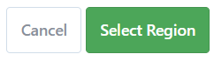
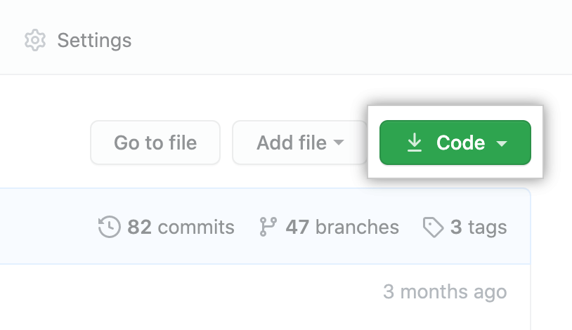

# Bake It Better

Bake It Better is a blog-style website for users to share baking recipes (generally referred to in this project as "bakes"). All users are able to browse bakes, and once users have created an account and signed in they can add, edit and delete their own.

- Signed-in users are also able to 'star' baking recipes. The star functions as both a like and a bookmark; users can view a list of all the bakes that they have starred.

- In addition, when a user creates an account they can access their own "Best For" Bakes section. This provides the user with what is essentially a planner function, where they can plan in bakes for a particular occasion e.g. a bake to take to a party or a recipe that is good for kids to bake.

Bake It Better has been developed using Agile methodology, and is written using Python + Django, HTML, CSS and Bootstrap. It is currently deployed via Heroku.

[View the live project here](https://bake-it-better.herokuapp.com/).

The site has been created for the fourth portfolio project for Code Institute's Diploma in Full Stack Software Development.

## User Experience
### Personas

Following interviews with actual and potential users of baking recipes and websites, user personas were developed to guide the development of the site:

#### Toby

Toby bakes regularly when he has time, mostly to relax in between his busy and irregular work schedule. He has a number of staple bakes that he comes back to time and time again, but he is also interested in trying new recipes. He likes to keep fit, cycles to work or the gym most days and generally tries to eat pretty healthily, so he would be interested in a feature where he can save a baking recipe and come back to it when he can make a cake, cookies or pie to share with friends or family or take to a party rather than eating it all himself! He would be interested in features such as:
- Being able to bookmark or save a baking recipe so he can find it again quickly, and potentially tag it as being suitable for a particular occasion
- Clear instructions, and the ability to switch the units of a bake since he has lost count of the number of times he has found what appears to be the perfect recipe, only to find that everything is measured in cups and ounces!
- Feedback and comments from other users: what worked well, what did they like, what would they improve?

#### Dawn

Dawn doesn't bake much, but she would like to start. She enjoys watching baking shows to relax and unwind after work - she and her partner don't have much overlap in TV genres that they both enjoy, but they do both enjoy watching baking and cookery programmes together. She could see herself baking a birthday cake for herself or her partner, making bread for Sunday brunch or taking a day at the weekend to bake something more complex such as croissants or macarons. She would like to see the following in a baking site:
- Simple and clear instructions, ideally with pictures of how the finished bakes should look
- A list of ingredients, so she can see at a glance if she has everything she needs in the house before she starts baking
- Some sort of metric of how much other people enjoyed a baking recipe
- How complicated a bake is to make
- Recommendations of other bakes: "If you liked this, you might also want to consider baking xyz"

#### Fred

Fred loves to bake, whether that's for himself or his family and friends; he enjoys baking various different types of bread to have with a main meal, pancakes for a Sunday brunch, exquisite cakes or his favourite Yorkshire puddings, which remind him and his family of home since they no longer live in the UK. His bakes have been painstakingly honed over time; he has adjusted them over months or years to see what works best: a touch more butter in the mixture here, or five minutes longer in the oven there. His baking creations are always appreciated by everyone who gets to taste them, and he would like to publish his lovingly developed recipes on a website so that others can also reap the benefit of the time and effort he has put into creating and refining them. He would like a site that includes:
- An easy way of adding baking recipes, including the possibility to add photos so that others can see the finished bake that they are aiming for
- The ability to edit recipes that he has previously added, so that when he improves them he can adjust them accordingly
- User comments, so that he can receive feedback on his bakes and make suggestions if other people are having difficulty with them
- The ability to give a realistic indication of how complex the bakes are to make: his Yorkshire puddings, for example, are super simple and would be great for a beginner, but he thinks it would be better to mark some of his bakes as "challenging" so that newer bakers do not become disheartened if they struggle!

#### Beth

Beth is retired and loves to spend time with her grandchildren. They often bake biscuits or cakes together since the kids can mix the dough and add icing and decorations at the end, but as they get older they are keen to try out some new bakes. Beth isn't sure what would be suitable but she would also find it more interesting if they could try out some new recipes together! When she has a whole day free, she also enjoys attempting new and more complex recipes herself and taking them to a family event or party, or keeping them for lunch with friends the next day. She would like to be able to:
- See at a glance how complicated a bake is to make, since she would prefer to stick to easy recipes with her grandkids but wants to challenge herself when she is alone
- Bookmark bakes for making herself or with the children
- Read other users' feedback or reviews of bakes
- Search by occasion for suitable recipes

### User Stories and Owner Goals

Once I had developed the user personas above, considering their needs helped me to formulate a number of Epics:

- Site Administration: this Epic is for the admin user to manage the site from the admin panel.
- User Navigation: this covers ease of navigation for general site users, both in terms of being physically able to navigate between pages and also points such as being easily able to identify the site's purpose on a first visit.
- User Profile: this Epic is for user stories relating to authentication of users such as creating and logging into and out of accounts.
- My Bakes: covers the CRUD functionality on bakes that a general site user adds themselves from the front end.
- Interaction with Other Users: for users to comment on or "star" (functioning as both a "like" and a bookmark-type functionality) others' bakes.
- Top Bakes: allows users to save bakes for different occasions to a planner-style database, termed "Best For Bakes" since the intention is for a user to be able to save bakes as being "best for" a certain occasion category (e.g. a bake to make with kids, a recipe for something to take to a party, etc.).
- Site Usability: this relates to the overall look, feel and ease of use of the website, including basic features such as correct display of the site header and footer, as well as custom error pages, consistent confirmation of actions via success messages and enabling admin capabilities for the admin user from the front end.

These were then broken down into User Stories:

- As a site admin, I can manage bakes so that I can control what appears on the site.
- As a site admin, I can create new bakes so that I can contribute my own content to the site; the bake can be completed in one go or saved as a draft in the admin panel so that I can finish writing the content later.
- As a site admin, I can approve comments from the admin panel so that I control what appears on the site.
- As a site user, I can view a list of bakes with enough information to choose one to view so that I can quickly decide which bake to view next.
- As a site user, I can see the list of bakes split onto separate pages so that I can view a manageable amount of information per page.
- As a site user, I can see at a glance how many users have starred a given bake so that I have an indication of how many others have found it useful.
- As a site user, I can view an individual bake with ingredients, method and other useful information so that I can bake it myself, like or comment.
- As a site user, I can view comments on a bake that I or others have posted, so that I can find out more information or different views about a particular bake.
- As a site user, I can register an account so that I can add, edit or delete my own bakes, comment on others' bakes, and / or save others' bakes to my starred or 'Best For' bakes.
- As a site user, I can log into or out of my account so that I can keep my account secure.
- As a site user, I can comment on other users' recipes so that I can give feedback, provide information or make suggestions.
- As a site user, I can see whether I am currently logged in so that I know if I am logged into the site at any given time.
- As a site user, I can add a star to a bake so that I can indicate that I like it, as well as marking it for my own future reference.
- As a site user, I can see which bakes I have starred from the summary list of all bakes on the index page, so that I know if I have already marked each bake as starred or not.
- As a site user, I can view all of my starred bakes on a single page, so that I can use this page for reference to quickly find bakes that I have marked as starred.
- As a site user, I can add my own baking recipes to the website so that I can share them with other users.
- As a site user, I can edit bakes that I have already added, so that I can add information or correct a mistake without needing to start again.
- As a site user, I can delete bakes that I have previously added, so that I can remove bakes that I no longer wish to share on the website.
- As a site user, I can edit and delete comments that I have previously made, so that I can correct a mistake or clarify a point.
- As a site user, I can view a page with a baking plan that contains Best For slots designed for a number of occasions, so that when I need a bake for a particular occasion I have one saved ready to make.
- As a site user, I can save a bake to a slot in My Best For Bakes, so that I can make a note of a bake that will be useful in a particular situation.
- As a site user, I can easily understand why I have received an error message and navigate back to the main site, so that I can continue to use the website as intended with minimal interruption.
- As a site user, I can use the navbar to find my way around the site in a quick and intuitive manner, so that the site is simple and pleasant to use.
- As a site user, I can follow links in the site footer to view and interact with Bake It Better's social media accounts.
- As a site user, I can use the site in such a way that it creates a pleasing overall experience in terms of the look and feel of the design and the flow of user actions.
- As a site user, I can see via a flash message when I have successfully completed an action on the website, so that I know that the action has been carried out as intended.
- As a site admin, I can edit and delete other users' bakes from the front end, so that I can quickly edit or remove content that I do not want on the website from my own account, without needing to log into the admin panel.
- As an admin user, I can approve or delete other users' pending comments from the front end, so that I can manage comments without needing to log into the admin panel.

Site owner goals were also noted. These do not map to user stories but were nevertheless a consideration during development:

- As a site owner, I can provide a website for bakers to discover new bakes and share their favourite bakes, so that they find a solution to help them enjoy baking.
- As a site owner, I can provide an option for bakers to comment on each others' bakes, so that their experience is enhanced by sharing useful information with others.
- As a site owner, I can discover new bakes myself and potentially receive feedback on my own bakes in the form of user comments, so that my own baking knowledge and experience also benefits.

For more information about the Epics and User Stories and how the creation of the content for these took place, please see the [Agile Development](https://github.com/frankiesanjana/bake-it-better/blob/main/docs/Agile.md) documentation of this project.

## Design
The website was designed according to the five planes of content strategy. Using this structure provided a framework to develop the website. This is explained in more detail below.

### Plane 1: Strategy
The strategy of the website is largely defined by the user and owner goals listed above in the User Experience section. The strategy is simply to provide solutions to the goals of the website's users and owners.

### Plane 2: Scope and Features
The site includes the following features:

#### Header

##### Logo

I created a custom logo for the site using [Hatchful](https://www.shopify.com/tools/logo-maker). The logo is positioned to the top left of the navigation bar and resizes as the screen size is adjusted, so that it does not dominate smaller screens or appear too small to see on larger screens.
- The logo links to the homepage for ease of navigation.

##### Navigation Bar
This appears on every page and includes links to the other pages.
- For users who are not signed in, only the main page, Sign Up and Log In links are displayed (as shown above), since all other pages require sign-in to access
- When users are signed in, the navigation bar automatically adjusts to the following view:

- This includes the user's username to confirm at a glance that they are signed in, and the Sign Up and Log In links are also removed.
- The Add a Bake link is displayed in the header, since this is judged to be an option that users may want to use most frequently.
- The links to My Starred Bakes, My Best For Bakes and the Log Out page are nested into a dropdown menu that can be accessed by clicking on the arrow next to the username as follows:

- Clicking on the arrow again, or elsewhere on the page, removes the dropdown menu.
- Hovering over the dropdown links shades the background for ease of navigation.
- The navigation bar collapses into a hamburger icon on smaller screens:

#### Footer

The footer is deliberately kept very simple so as not to detract from the main content of the site. It includes links out to Facebook, Instagram and Twitter:

- The links in the footer will open in a new tab, to avoid directing the user away from the site.
- The footer resizes in order to display in an aesthetically pleasing and consistent manner as screen size is adjusted.

#### Homepage

- The homepage begins with a welcome message and intro text, to enable new users to see at a glance what the site is about and briefly explain its functionality. Users are notified in the welcome message that signup will allow access to much more functionality, but are able to continue to browse without being pushed to sign up.

- Users are deliberately not presented with a signup button at this point. New users to a website are unlikely to sign up at this stage even if presented with a signup button, since they are still becoming familiar with the site and do not yet have a compelling reason to do so.
- Visitors who are pushed to sign up to a website before they are sufficiently familiar with it are highly likely to simply navigate away from the site: [Nielsen Norman Group](https://www.nngroup.com/articles/login-walls/) research notes this, saying "In our many usability tests, we rarely have seen users more annoyed than when they come across a login wall" and "Demanding that users register or log in before they can use an app or see website information has high interaction cost".

- For this reason, and given that users can choose to sign up at any time by using the links in the navigation bar, the homepage continues straight to the main content:

- All published bakes are displayed as cards, with the most recent first.
- Each bake card displays the bake's image, title, author and date of publication.
- Hovering over a bake card underlines the title of the bake on the card.
- Clicking on a bake card redirects the user to the detailed page for that bake.
- The cards are paginated every eight recipes.
- A single card is displayed per row on the smallest screens, and this increases gradually to two cards per row, three and then four on the largest screen sizes.

- When a user is signed in, if that user is the author of a bake, the bake card will have Edit and Delete buttons underneath it to allow users to edit or delete their bakes:

- Since the admin user is authorised to edit and delete all bakes, the admin user's homepage view includes Edit and Delete buttons for all bake cards:

#### Bake Detail page

- The Bake Detail page is displayed differently for non-signed-in and signed-in users.

##### Non-signed-in users

- For non-signed-in users, who are likely to be new users, the page is kept simple. Since they cannot star a bake without being signed in, the star information for the bake is not shown. Buttons to edit and delete the bake are shown only for signed-in author users and the admin user, so these are not shown in any case, and the "Add to Plan" option is not displayed either unless a user is signed in.
    - Many users to a baking site are not interested in the additional functionality that Bake It Better has to offer and simply want to find a recipe. This approach allows these users to find what they are looking for easily and without distraction, and will hopefully mean they are more likely to return to the site in the future.
- The page as displayed to non-signed-in users begins as follows:

and continues:

- The author, publication date and level of difficulty are published at the top of the bake's recipe, in response to users' comments during interviews that they like to follow particular authors, keep up with newly published bakes and know at a glance how difficult they can expect a bake to be.
- The description follows next, to give a high-level overview of the bake.
- The equipment needed, ingredients and method are then listed.
- The number of comments is noted at the bottom of the bake to provide this information briefly without detracting from the main content; interested users can continue to the comments box below.
- The comments box is separate from the main bake, since many users may not be interested in this. However, for those who are, there are links to sign up and log in. This also serves as a reminder for users who may have forgotten that there is additional functionality available for those who do create an account.

##### Signed-in users

- For signed-in users, more information and options are displayed as follows:

- The bake's number of stars is displayed together with the star icon. Since the logged-in user is also the author of this recipe the Edit and Delete buttons are displayed, and the Add to Plan button is displayed.
- The star icon shown in the view above is solid red. This style is for bakes that have stars, but have not been starred by the current user.
- Bakes with no stars have the following icon, with an empty star:

- Bakes that have been starred by the current user have stars coloured gold:

For signed-in users, the comments section appears as follows, with any comments that have already been left first, followed by an invitation to leave a comment, a textbox in which to type a comment, and a Submit button:

#### User Account Pages

- The user account pages use Django allauth to create the Sign Up, Sign In and Sign Out functionality.
- Each of these actions is confirmed to the user via a success message.

##### Sign Up

##### Sign In

##### Sign Out

##### Success Message

- An example success message is shown below.
- Success messages display for three seconds before automatically disappearing, or can be removed sooner by the user if they click the cross on the right-hand side of the success message.

#### Add Bake Form

- Logged in users can add a bake via the Add a Bake link shown above in the navigation bar.
- The Add Bake form is enhanced by applying a [Summernote](https://summernote.org/) widget to the Description, Equipment, Ingredients and Method fields. This allows the user to format text, should they wish to do so. For example, a user might choose to add headings, make text a different colour, add bullet points or change the font.
    - Summernote describes itself as a WYSIWYG editor, meaning "what you see is what you get", i.e., it lets the user make changes and immediately see how they will look on the live website.
- The Description field is optional, since a user might have a great bake to share but not immediately be able to think of a creative description that adds significantly to the title.

- The Image field is also optional, since a user may not have an image of the bake. If the user does not upload an image, a placeholder image is used instead.
- When no image has been selected, the form displays a message saying "No file chosen":

- Clicking the "Choose File" button opens the file explorer and allows the user to select an image.
- When an image has been selected and uploaded, the filename of the image is displayed to confirm to the user that it has been added successfully:

- If a user does not complete all of the Title, Equipment, Ingredients and Method fields, the form will not submit and a warning will display.
- The Difficulty field is also mandatory, but "easy" is selected as a default, so the form will still submit if a user does not interact with this field.
- As shown above, for ease of identification of compulsory fields, an asterisk (*) is used next to these fields.
- If a user attempts to add a bake when they are not signed in, by either altering or copying and pasting the URL, the user will be redirected to the login page.
- When a user successfully adds a bake, a success message is displayed to confirm this.

#### Edit Bake Form

- Logged in users who are the author of a given bake can edit the bake via the Edit Bake button shown above on the Bake Detail page or via the Edit Bake button that appears under the bake cards on the bake cards displays (shown above for the homepage and also displayed in the My Starred Bakes page for any relevant bakes).
- The Edit Bake form uses Summernote in the same fields as the Add Bake form as described above.
- When the Edit Bake form is opened, all fields are pre-populated with the existing content:

- If a user attempts to edit a bake when they are not signed in, by either altering or copying and pasting the URL, the user will be redirected to the login page.
- If a user attempts to edit another user's bake, they will receive a custom 403 error page.
- When a user successfully edits a bake, a success message is displayed to confirm this.

#### Delete Bake 

- Logged in users who are the author of a given bake can delete the bake via the Delete Bake button shown above on the Bake Detail page or via the Delete Bake button that appears under the bake cards on the bake cards displays (shown above for the homepage and also displayed in the My Starred Bakes page for any relevant bakes).
- When a user clicks on the Delete Bake button, they are taken to a confirmation form.
- The form includes the name of the bake, so that the user can be sure that they are deleting the correct bake:
- When a user successfully deletes a bake, a success message is displayed to confirm this.

#### My Starred Bakes Page

- The My Starred Bakes page allows a user to see all the bakes that they have starred. Starring a bake functions as both a "Like" and as a bookmark, since it adds the starred bake to this list.
- If a user visits the My Starred Bakes page without having starred any bakes yet, they will be shown a message to explain this and invite them to visit the homepage to browse all bakes:

- When a user has starred one or more bakes, the bakes will be displayed on their My Starred Bakes page as bake cards.
    - The cards are displayed, ordered and paginated in the same way as on the homepage, to maintain a consistent experience.
    - Also similarly to the homepage, Edit and Delete buttons are displayed by a bake card for the author or admin users:

- If a user attempts to view their starred bakes when they are not signed in, by either altering or copying and pasting the URL, the user will be redirected to the login page.

#### Best For Bakes Plan

- The Best For Bakes section provides signed in users with a planner where they can plan in bakes for a particular occasion e.g. a bake to take to a party or a recipe that is good for kids to bake.
- If a user visits their Best For Bakes plan before having added any bakes to the plan, they will see the list of occasions with placeholder cards as follows:

- If a user adds a bake to their plan for a particular occasion, the placeholder card for that occasion will be replaced by the bake that they have added.
    - If a user updates the plan, the new bake replaces the existing bake in that slot (each slot only displays a single bake):

- The bake cards in the Best For section do not display Edit and Delete buttons. It was felt that this could be too confusing for users, who might think that this referred to deleting them from the plan, rather than deleting the bake itself.
    - Otherwise, they display the same as the bake cards on the homepage.
- Clicking anywhere on a bake card redirects to the detailed page for that bake.
- Clicking anywhere on a placeholder card redirects to home.
- To add a bake to their Best For bake plan, a user can click on the "Add to Plan" button on the detailed page for that bake.
    - Doing so brings up a modal:

- The modal includes a dropdown list, from which the user can select the occasion that they would like to add the bake for.
- Hovering over options in the list shades the background and changes the text colour to provide visual guidance for users:

- Clicking Save will save the bake to the chosen occasion slot in the Best For plan and display a confirmation message to the user:

- Returning to the Best For page will then display the selected bake in the chosen occasion slot.
- If a user attempts to access their Best For page when they are not signed in, by either altering or copying and pasting the URL, the user will be redirected to the login page.

#### Custom Error Pages

- Custom error pages have been provided to give users more information on errors they may encounter and help them navigate back to the site.
- 403 error: Forbidden - "You do not have permission to access this page. Click here to return home."

- 404 error: Page Not Found - "Sorry, the page you are trying to access cannot be found. Click here to return home."

- 400 error: Bad Request - "Sorry, the page you are trying to access cannot be found. Click here to return home."
- 500 error: Internal Server Error - "Sorry, there is a problem with the page you are trying to access. Click here to return home."

A number of features were identified that were desirable but were ultimately not within the scope of the project:
- Two features were marked as Won't Have on the Agile project board due to time constraints and would be good features to develop in the future:
    - Enable editing and deleting of comments by the author of the comment
    - Build the functionality for the admin user to approve or discard other users' comments from the front end, rather than having to log into the admin panel
- Other desired features that have not been included in the current website are:
    - Enable unit conversion between metric and imperial
    - Incorporate the ability for users to apply filters to the website (e.g. filter for only bakes with a difficulty rating of "easy", etc.)
    - Add functionality for users to search all bakes using keywords
    - Expand the Best For page into separate pages so that a user can save multiple bakes for each occasion, as well as being able to customise what the occasions are

### Plane 3: Structure and Data Model

The program uses Object Oriented Programming and Django's Class-Based Generic Views.

The user authentication system uses Django AllAuth.

The standard Django User model is used.

Custom models for Bake It Better are:

- Bake: represents a baking recipe created by a user and saved to the database. The bake author is a foreign key from the Bake to the User model, since a bake only has one author.
- Comment: represents a comment created by a user to comment on an individual bake. Since a comment is only applicable to a single recipe, the Bake is a foreign key in the Comment model.
- Best For: allows users to add a Bake to their Best For plan for a given occasion. Each Best For instance saved to the database has a specified single user and bake. As such, the Best For model is linked via foreign keys to the User and Bake models.

#### Database Schema

The structure of the database schema is detailed in the diagram below, which was created using Microsoft PowerPoint (click image to enlarge):

### Plane 4: Skeleton and Wireframes

Wireframes for the project can be seen below. These were developed on mobile, since due to the nature of the site and the way it is likely to be used, Bake It Better is very much a mobile-first site:

 

 

### Plane 5: Surface

#### Colour Scheme

A simple colour scheme was developed using the [Coolors](https://coolors.co/) colour palette, in combination with iterations of user testing and feedback. The intention was to provide an attractive background to the website without detracting from the content. Since the website has a relatively large number of media items and images can be uploaded by users, it was important to select neutral background colours that will fit well with a wide range of other colours.

The combination of the text and background colours used on the website have also been checked for sufficient contrast to ensure accessibility; for further details on this, please see the separate [Testing documentation](https://github.com/frankiesanjana/bake-it-better/blob/main/docs/Testing.md).

#### Typography

The Poppins font has been used for the main text in the body of the website; this is a simple font chosen for its ease of readability. The Lobster font has been used for headings. This is a slightly more artistic style of font intended to add a touch of style to the site. I was wary of choosing a font that was too complex or difficult to read and so user testing and feedback has been obtained to ensure that it remains sufficiently clear, including for one user who has dyslexia but assured me that they still found it both perfectly readable and aesthetically pleasing. The Sans Serif font is set as a backup in case the main fonts are not being imported correctly into the site.

## Agile Methodology
For each sprint, the user stories for that sprint were added to the project board. Each user story is marked as belonging to its parent Epic, and has acceptance criteria that had to be met before it could be marked as complete. Associated developer tasks are listed below the acceptance criteria for each user story, and Story Points (an estimate made before work is begun that reflect the amount of work needed to complete a user story) have also been noted.

Further notes about the Agile development are described in the [Agile documentation here](https://github.com/frankiesanjana/bake-it-better/blob/main/docs/Agile.md) and the user stories can be seen on the [project board](https://github.com/users/frankiesanjana/projects/6/views/1) that was used to manage Agile development.

## Testing
- The testing undertaken for this project is described in detail in separate [Testing documentation](https://github.com/frankiesanjana/bake-it-better/blob/main/docs/Testing.md).

## Security Features and Defensive Design

### Database Security

The database URL, secret key and Cloudinary URL are stored in the env.py file to prevent any unwanted connections to the database. This was never pushed to GitHub and was set up before the first push to ensure security.

Cross-Site Request Forgery (CSRF) tokens were implemented on all forms throughout the site to protect against CSRF attacks.
- A CSRF token is a unique, secret, and unpredictable value that is generated by the server-side application and shared with the client.
- When attempting to perform a sensitive action, such as submitting a form, the client must include the correct CSRF token in the request.
- This makes it very difficult for an attacker to construct a valid request on behalf of the victim.

### User Authentication

Django's LoginRequiredMixin is used to ensure that any requests to access secure pages by non-authenticated users are redirected to the login page.

Django's UserPassesTestMixin is used to limit access based on certain permissions. It ensures that users can only edit / delete bakes for which they are the author, except for the admin user who is also able to perform these actions. If the user doesn't pass the test they will be shown an HTTP 403 Forbidden error page.

### Form Validation

If invalid data is entered into a form or a compulsory field is left blank, the form will not submit. Warning messages will display to inform the user which field or fields need to be corrected.

### Custom Error Pages

Custom error pages have been created to provide more information to the user if they encounter an error. The error pages also include links to enable the user to navigate back to the site. Error messages are as follows:
- 403 error: Forbidden - "You do not have permission to access this page. Click here to return home."
- 404 error: Page Not Found - "Sorry, the page you are trying to access cannot be found. Click here to return home."
- 400 error: Bad Request - "Sorry, the page you are trying to access cannot be found. Click here to return home."
- 500 error: Internal Server Error - "Sorry, there is a problem with the page you are trying to access. Click here to return home."

## Technologies / Languages / Frameworks

### Languages

- [Python](https://www.python.org/)
- [HTML](https://en.wikipedia.org/wiki/HTML)
- [CSS](https://en.wikipedia.org/wiki/CSS)
- [JavaScript](https://en.wikipedia.org/wiki/JavaScript)

### Frameworks and Libraries

- [Django 3.2](https://www.djangoproject.com/) is a Python-based web framework that follows the model–template–views architectural pattern.
- [Django AllAuth](http://www.intenct.nl/projects/django-allauth/) is an integrated set of Django applications addressing authentication, registration, account management.
- [Django Crispy Forms](https://django-crispy-forms.readthedocs.io/en/latest/) controls the rendering behaviour of Django forms.
- [Psycopg2](https://pypi.org/project/psycopg2/) is a PostgreSQL database adapter for the Python programming language.
- [Gunicorn](https://gunicorn.org/) is a Python WSGI HTTP server, used to run the project.
- [Cloudinary](https://cloudinary.com/) enables storage of media and static files in conjunction with [Django Cloudinary Storage](https://pypi.org/project/django-cloudinary-storage/).
- [Bootstrap 4.6](https://getbootstrap.com/docs/4.6/getting-started/introduction/) is a front-end CSS and JavaScript framework.

### Other Technologies and Resources

- [Balsamiq](https://balsamiq.com/) was used to create wireframes for the project.
- [Gitpod](https://www.gitpod.io/) is an online integrated development environment that was used to write my code.
- [Git](https://git-scm.com/) was used for version control by committing changes via Gitpod. Changes are then stored by pushing them to GitHub.
- [GitHub](https://github.com/) was used to store the project code after pushing it from Git.
- [Heroku](https://www.heroku.com/) is a platform as a service (PaaS) that enables developers to build, run, and operate applications entirely in the cloud, and was used to deploy the live project.
- [ElephantSQL](https://www.elephantsql.com/) is used to host the project database.
- [Google Fonts](https://fonts.google.com/) was used to provide the fonts used in this project.
- [Amiresponsive](http://ami.responsivedesign.is/) was used to create the image at the top of this document.
- [MS PowerPoint](https://www.microsoft.com/en-us/microsoft-365/powerpoint) was used to draw out the data schema for the program.
- [MS Excel](https://www.microsoft.com/en-ww/microsoft-365/excel) was used for general project planning and for manual testing documentation.
- [W3C HTML Validator](https://validator.w3.org/) was used to validate HTML code.
- [W3C CSS Validator](https://jigsaw.w3.org/css-validator/validator) was used to validate CSS code.
- [CI's Python Linter](https://pep8ci.herokuapp.com/) was used to test Python code.
- [JSHint validator](https://jshint.com/) was used to test JavaScript code.
- Images for the bakes are from [Pexels](https://www.pexels.com/) and [Pixabay](https://pixabay.com/).
- Baking recipes are taken from the [Great British Bake Off](https://thegreatbritishbakeoff.co.uk/) and [BBC Good Food](https://www.bbcgoodfood.com/) websites.
- The Bake It Better logo was developed using [Hatchful](https://www.shopify.com/tools/logo-maker) and converted into a favicon using [Favicon](https://favicon.io/favicon-converter/).
- [Font Awesome](https://fontawesome.com/) and [Bootstrap](https://icons.getbootstrap.com/) icons were used to add decoration to the text.
- My secret key for Django was generated using [Djecrety](https://djecrety.ir/).
- The option for users to add custom styles for text uses [Summernote](https://summernote.org/).
- [Coolors](https://coolors.co/) was used to develop and accessibility test the colour palette.

## Build & Deployment

### Build

#### Create the repository

- Sign into GitHub and navigate to [Code Institute's Gitpod Template](https://github.com/Code-Institute-Org/gitpod-full-template):

- Using the button at the top of the repo, click "Use this template" and then select "Create a new repository":

- Create a name and, optionally, a description for the repository, then click on the green "Create repository from template" button below.

- Your repository will be generated within a few seconds and you will be automatically taken to the repository. Click the green "Gitpod" button to open in Gitpod and begin editing.

#### Install Django and supporting libraries

Note that at the time this project is being created, Django 3.2 is the LTS (Long Term Support) version of Django and is therefore preferable to use over the newest beta Django 4.

- Install Django and gunicorn: `pip3 install 'django<4' gunicorn`
- Install supporting libraries: `pip3 install dj_database_url==0.5.0 psycopg2`
- Install Cloudinary libraries: `pip3 install dj3-cloudinary-storage`
- Create a requirements file: `pip3 freeze --local > requirements.txt`
    - This file saves a list of all the dependencies (libraries, packages, modules) that are needed for the project.
- Create the project: `django-admin startproject PROJ_NAME . `
    - For this project, the project name is bake-it-better
    - Remember to include the `.` after the project name - this tells Django admin to create the project in the current directory
    - A new directory should be created with the project name, including a number of files
    - A `manage.py` file should also be created
- Create an app witin the project: `python3 manage.py startapp 'APP_NAME'`
    - For this project, the app name is bakes
    - A project can have multiple apps, which will all need to be added to the `settings.py` installed apps (see next step)
- Within `settings.py` in the project directory, add it to your `INSTALLED_APPS`:
- `INSTALLED_APPS = [
    …
    'APP_NAME',
]`
- Save the changes.
- Within the terminal:
    - Migrate the changes: `python3 manage.py migrate`
    - Note that if you create another app within the project, migrations will be automatically created for the new app and this command will need to be run again so that new changes are also added to the database
- Run the server: `python3 manage.py runserver`
    - A popup should appear in the bottom right-hand corner of your Gitpod window:

    

- Click on "Open Browser" and a new tab will open to preview the project. You should see the following message:

### Deployment

#### Create a new external database

On elephantsql.com:
- Log in to your ElephantSQL account to view your dashboard

- Click the green button on the top left-hand side of the screen, “Create New Instance”:

- Set up your plan:
    - Give your plan a Name (usually the name of the project)
    - Select the Tiny Turtle (Free) plan
    - The Tags field can be left blank

- Click “Select Region”:

- Select a data center near you:
    - Note: If you receive a message saying "Error: No cluster available in your-chosen-data-center yet", choose another region

- Click “Review”:

- Check that your details are correct. Then click “Create instance”:

- Return to the ElephantSQL dashboard and click on the database instance name for this project

- Copy your ElephantSQL database URL using the Copy icon (see red arrow in the picture below). It will start with postgres://
    - This URL can now be used when linking the database to the project's GitHub repository.

#### Create the Heroku app

- Sign up / log in to Heroku.
- Create a new app from the Heroku dashboard:

- Choose a unique name for your app and select your region, then click "Create app". Note that unlike GitHub, the name must be unique across all of Heroku, not just unique to your own account:

- From your new app, select the Settings tab:

- Scroll down to the Config Vars section and click on "Reveal Config Vars":

- Add a Config Var with a key of DATABASE_URL and a value of the ElephantSQL database url you copied in the previous step above:

- Once you have entered the key and value, click the Add button to confirm the Config Var:

#### Attach the Database

- In Gitpod, create a new file `env.py` in the top level directory.
- In `env.py`:
    - Import os library - `import os`
    - Set environment variables - `os.environ["DATABASE_URL"] = "Paste in ElephantSQL database URL"`
    - Add in secret key - `os.environ["SECRET_KEY"] = "Make up your own randomSecretKey"`
- In Heroku:
    - Add Secret Key to Config Vars:
        - key - SECRET_KEY
        - value - randomSecretKey (as entered in the `env.py` file)
- In Gitpod, in your `settings.py` file:
    - Reference env.py with the following code:
        - `import os`
        - `import dj_database_url`
        - `if os.path.isfile("env.py"): import env`
    - Remove the insecure secret key and replace it as follows:
        - `SECRET_KEY = os.environ.get('SECRET_KEY')`
    - Comment out the existing Databases section:
        - `#DATABASES = {`
        - `#'default': {`
        - `#'ENGINE': 'django.db.backends.sqlite3',`
        - `#'NAME': BASE_DIR / 'db.sqlite3',`
        - `#}`
        - `#}`
    - Add new Databases section:
        - `DATABASES = {'default': dj_database_url.parse(os.environ.get('DATABASE_URL'))}`
- Save all files, and make migrations in the terminal: `python3 manage.py migrate`

#### Get static and media files stored on Cloudinary

- Log in / sign up to [Cloudinary](https://cloudinary.com/)
- From your Cloudinary dashboard, copy the API Environment Variable with CLOUDINARY_URL:

- In Gitpod, in your `env.py` file, add the Cloudinary URL; be sure to paste in the correct section of the link
    - `os.environ["CLOUDINARY_URL"] = "cloudinary://************************"`

- In Heroku, add the Cloudinary URL to the Config Vars; be sure to paste in the correct section of the link
    - key: CLOUDINARY_URL
    - value: cloudinary://************************

- Still in Heroku, add DISABLE_COLLECTSTATIC to the Config Vars
    - key: DISABLE_COLLECTSTATIC
    - value: 1
    - <strong>NOTE: this is a temporary step for the moment and this will be removed before deployment.</strong>

- In Gitpod, in your `settings.py` file, add the Cloudinary Libraries to installed apps
    - `INSTALLED_APPS = [`
    - `…,`
    - `'cloudinary_storage',`
    - `'django.contrib.staticfiles',`
    - `'cloudinary',`
    - `…,`
    - `]`
    - <strong>NOTE: the order of these is important.</strong>

- Tell Django to use Cloudinary to store media and static files with the following code - <em>Place under the Static files</em>:

#### Deploying to Heroku

- Link file to the templates directory in Heroku - <em>Place under the `BASE_DIR` line</em>:
    - `TEMPLATES_DIR = os.path.join(BASE_DIR, 'templates')`

- Change the templates directory to `TEMPLATES_DIR` - <em>Place within the `TEMPLATES` array</em>:
    - `TEMPLATES = [`
    - `{`
    - `…,`
    - `'DIRS': [TEMPLATES_DIR],`
    - `…,`
    - `],`
    - `},`
    - `},`
    - `]`

- Add Heroku Hostname to `ALLOWED_HOSTS` (e.g. bake-it-better): `ALLOWED_HOSTS = ["PROJ_NAME.herokuapp.com", "localhost"]`

- In Gitpod:
    - Create three new folders in the top level directory - `media`, `static` & `templates`.
    - Create a file named Procfile in the top level directory - `Procfile`
        - Note that this file must live in the root directory and does not function if placed elsewhere.
        - The Procfile specifies the commands that are executed by a Heroku app on startup.

- In the Procfile, add the code: `web: gunicorn PROJ_NAME.wsgi`

- Save all files, then in the terminal, add, commit and push all files:
    - `git add .`
    - `git commit -m “Deployment Commit”`
    - `git push`

- In Heroku, in your app's Settings tab, below the Config Vars section there is a Buildpacks section.
    - Click the "Add Buildpack" button:

    - Select the Python buildpack and click "Save Changes":

- In Heroku, in the Deploy tab:
    - Select "Connect to GitHub" from the deployment methods section.
    - Search for the name of the GitHub repository to connect to.
    - Click Connect.
    - Your Heroku app should now be connected to your GitHub account:

- Further down the Deploy tab, you have the option to choose to Enable Automatic Deploys or, if you would prefer to deploy manually, select Deploy Branch.
    - Note that if you deploy manually, you will need to re-deploy each time the repository is updated.
    - Note that if you deploy automatically, it is not uncommon to receive a notification that automatic deployment has failed. For this project, this has so far always been successfully fixed by going to Heroku and manually redeploying.

- The build log will update and when the app has deployed successfully, you can click on View to view the deployed site.

## Forking this repository
It is possible to copy the repository in order to experiment with your own changes without affecting the original project. The steps to do this as as follows:

- Navigate to the GitHub website.
- Log in if necessary.
- Navigate to the repository that you want to fork - the repo for this project is [Bake It Better](https://github.com/frankiesanjana/bake-it-better).
- In the top right-hand corner of the page, click on "fork".
- You will be taken to a page to create your own fork. You can edit the project name and add a description (optional).
- Click on "create fork" to complete the process.

## Cloning this repository
It is also possible to copy the repository onto your own local machine. In practice, this might be done to make it easier to fix merge conflicts, add or remove files, and push larger commits. To do this, follow these steps:

- Navigate to the GitHub website.
- Log in if necessary.
- Navigate to the repository that you want to clone - the repo for this project is [Bake It Better](https://github.com/frankiesanjana/bake-it-better).
- Above the list of files, find the "Code" button and click on it:

- To clone the repository using HTTPS, under "Clone with HTTPS", click the clipboard icon. To clone the repository using an SSH key, including a certificate issued by your organization's SSH certificate authority, click Use SSH, then click the clipboard icon. To clone a repository using GitHub CLI, click Use GitHub CLI, then click the clipboard icon.
- Open your computer terminal.
- Change the current working directory to the location where you want the cloned directory.
- Type "git clone" and then paste the location that you have copied.
- Press "enter" and your local clone will be created.

## Credits

### General Coding Skills

I made extensive use of various online resources to improve my understanding and knowledge before and during this project, including:

- reading about correct development of user stories as opposed to dev tasks on [Industrial Logic](https://www.industriallogic.com/blog/as-a-developer-is-not-a-user-story/) and refinement of Epics to User Stories via [Christian Strunk](https://www.christianstrunk.com/blog/user-stories-and-epics-for-the-win)
- working through [Codecademy's Django tutorial](https://www.codecademy.com/learn/paths/build-python-web-apps-with-django), which was particularly useful for learning how to write the different types of class-based views in Django
- referring to [VeryAcademy's YouTube channel](https://www.youtube.com/c/veryacademy) for more info on several aspects of Django as well as revisiting Bootstrap
- reading through much of the [Django documentation](https://www.djangoproject.com/) and [Bootstrap documentation](https://getbootstrap.com/docs/4.6/getting-started/introduction/)
- using [Stack Overflow](https://stackoverflow.com/) for troubleshooting and debugging a number of issues, the more project-specific of which are highlighted in the following section
- reminding myself of some HTML and, in particular, CSS basics at [W3 Schools](https://www.w3schools.com/)

I also referred frequently to both the Hello Django and I Think Therefore I Blog tutorials on [Code Institute](https://codeinstitute.net/)

### Specific to the Project
#### Coding

Firstly, thanks to the team at Code Institute Tutor Support for providing just the right level of help and hints to enable me to figure out answers for myself!

I used [Code Institute](https://codeinstitute.net/)'s I Think Therefore I Blog walkthrough project to help me get started on this project. There are a few sections of code that are taken from the walkthrough project and remain relatively or completely unchanged. These are noted in the code and are also listed below:
- The Django code used to provide success messages to confirm user actions in `base.html`, rows 79-93
- The JavaScript code used to fade out these success messages in `base.html`, rows 114-121
- The pagination code used in `index.html` rows 47-59, `best-for-bakes.html` rows 66-78 and `my-starred-bakes.html` rows 58-70

A number of articles and blog posts were useful to help me for specifics of this project:

- The success message for deleting a bake adapted the code from a [Stack Overflow post](https://stackoverflow.com/questions/24822509/success-message-in-deleteview-not-shown).
- The modal on the bake-detail.html page where a user can add Best For bakes used Bootstrap's [modal documentation](https://getbootstrap.com/docs/4.6/components/modal/).
- Automated testing was informed by this [list of Python assert methods](https://www.mattcrampton.com/blog/a_list_of_all_python_assert_methods/) and the [Python unit testing documentation](https://docs.python.org/3/library/unittest.html).

#### Other

- Some of the screenshots of images in the Build and Deployment section of this document are taken from [Code Institute's](https://codeinstitute.net/) student guide on [deployment](https://code-institute-students.github.io/deployment-docs/80-migrating-databases-for-heroku/migrating-databases-01-create-a-database).
- Information about CSRF tokens for this document is from [PortSwigger](https://portswigger.net/web-security/csrf).

### Acknowledgements

- Thank you to my mentor Akshat Garg for project guidance and review.
- Thanks to my fellow students for support, advice and encouragement via Slack.
- Thanks to Ed Stanley for providing user feedback during development.
- Thank you to Jenna Fields and Josh Stanley for testing the website on different devices.