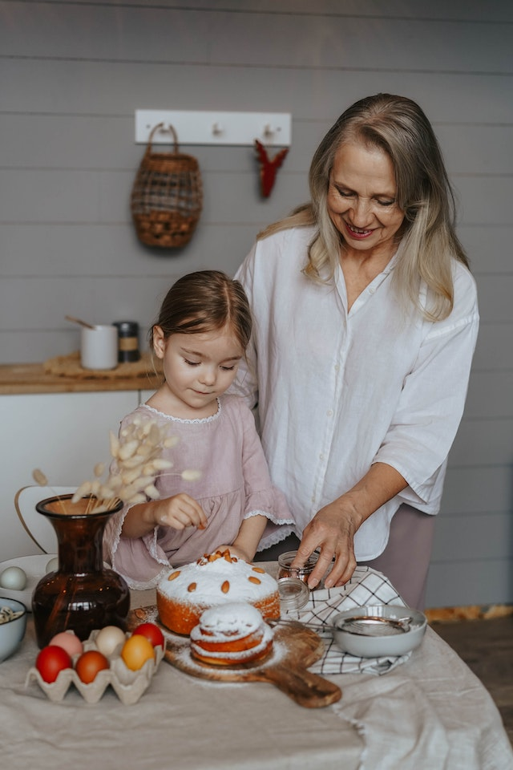

# Bake It Better

Bake It Better is a blog-style website for users to share baking recipes (also referred to as "bakes"). All users are able to browse bakes, and once users have created an account and signed in they can add, edit and delete their own.

- Signed-in users are also able to 'star' baking recipes. The star functions as both a like and a bookmark; users can view a list of all the bakes that they have starred.

- In addition, when a user creates an account they can access their own "Best For" Bakes section. This provides the user with what is essentially a planner function, where they can plan in bakes for a particular occasion e.g. a bake to take to a party or a recipe that is good for kids to bake.

Bake It Better has been developed using Agile methodology, and is written using Python + Django, HTML, CSS and Bootstrap. It is currently deployed via [Heroku](https://www.heroku.com/).

[View the live project here](https://bake-it-better.herokuapp.com/).

The site has been created for the fourth portfolio project for Code Institute's Diploma in Full Stack Software Development.

## User Experience
### Personas

Following interviews with actual and potential users of baking recipes and websites, user personas were developed:

#### Toby

Toby bakes regularly when he has time, mostly to relax in between his busy and irregular work schedule. He has a number of staple bakes that he comes back to time and time again, but he is also interested in trying new recipes. He likes to keep fit, cycles to work or the gym most days and generally tries to eat pretty healthily, so he would be interested in a feature where he can save a baking recipe and come back to it when he can make a cake, cookies or pie to share with friends or family or take to a party rather than eating it all himself! He would be interested in features such as:
- Being able to bookmark or save a baking recipe so he can find it again quickly, and potentially tag it as being suitable for a particular occasion
- Clear instructions, and the ability to switch the units of a bake since he has lost count of the number of times he has found what appears to be the perfect recipe, only to find that everything is measured in cups and ounces!
- Feedback and comments from other users: what worked well, what did they like, what would they improve?

#### Dawn

Dawn doesn't bake much, but she would like to start. She enjoys watching baking shows to relax and unwind after work - she and her partner don't have much overlap in TV genres that they both enjoy, but they do both enjoy watching baking and cookery programmes together. She could see herself baking a birthday cake for herself or her partner, making bread for Sunday brunch or taking a day at the weekend to bake something more complex such as croissants or macarons. She would like to see the following in a baking site:
- Simple and clear instructions, ideally with pictures of how the finished bakes should look
- A list of ingredients, so she can see at a glance if she has everything she needs in the house before she starts baking
- Some sort of metric of how much other people enjoyed a baking recipe
- How complicated a bake is to make
- Recommendations of other bakes: "If you liked this, you might also want to consider baking xyz"

#### Fred

Fred loves to bake, whether that's for himself or his family and friends; he enjoys baking various different types of bread to have with a main meal, pancakes for a Sunday brunch, exquisite cakes or his favourite Yorkshire puddings, which remind him and his family of home since they no longer live in the UK. His bakes have been painstakingly honed over time; he has adjusted them over months or years to see what works best: a touch more butter in the mixture here, or five minutes longer in the oven there. His baking creations are always appreciated by everyone who gets to taste them, and he would like to publish his lovingly developed recipes on a website so that others can also reap the benefit of the time and effort he has put into creating and refining them. He would like a site that includes:
- An easy way of adding baking recipes, including the possibility to add photos so that others can see the finished bake that they are aiming for
- The ability to edit recipes that he has previously added, so that when he improves them he can adjust them accordingly
- User comments, so that he can receive feedback on his bakes and make suggestions if other people are having difficulty with them
- The ability to give a realistic indication of how complex the bakes are to make: his Yorkshire puddings, for example, are super simple and would be great for a beginner, but he thinks it would be better to mark some of his bakes as "challenging" so that newer bakers do not become disheartened if they struggle!

#### Beth

Beth is retired and loves to spend time with her grandchildren. They often bake biscuits or cakes together since the kids can mix the dough and add icing and decorations at the end, but as they get older they are keen to try out some new bakes. Beth isn't sure what would be suitable but she would also find it more interesting if they could try out some new recipes together! When she has a whole day free, she also enjoys attempting new and more complex recipes herself and taking them to a family event or party, or keeping them for lunch with friends the next day. She would like to be able to:
- See at a glance how complicated a bake is to make, since she would prefer to stick to easy recipes with her grandkids but wants to challenge herself when she is alone
- Bookmark bakes for making herself or with the children
- Read other users' feedback or reviews of bakes
- Search by occasion for suitable recipes

### User Stories and Owner Goals

Once I had developed the user personas above, considering their needs helped me to formulate a number of Epics. These were then broken down into User Stories:

- As a site admin, I can manage bakes so that I can control what appears on the site.
- As a site admin, I can create new bakes so that I can contribute my own content to the site; the bake can be completed in one go or saved as a draft in the admin panel so that I can finish writing the content later.
- As a site admin, I can approve comments from the admin panel so that I control what appears on the site.
- As a site user, I can view a list of bakes with enough information to choose one to view so that I can quickly decide which bake to view next.
- As a site user, I can see the list of bakes split onto separate pages so that I can view a manageable amount of information per page.
- As a site user, I can see at a glance how many users have starred a given bake so that I have an indication of how many others have found it useful.
- As a site user, I can view an individual bake with ingredients, method and other useful information so that I can bake it myself, like or comment.
- As a site user, I can view comments on a bake that I or others have posted, so that I can find out more information or different views about a particular bake.
- As a site user, I can register an account so that I can add, edit or delete my own bakes, comment on others' bakes, and / or save others' bakes to my starred or 'Best For' bakes.
- As a site user, I can log into or out of my account so that I can keep my account secure.
- As a site user, I can comment on other users' recipes so that I can give feedback, provide information or make suggestions.
- As a site user, I can see whether I am currently logged in so that I know if I am logged into the site at any given time.
- As a site user, I can add a star to a bake so that I can indicate that I like it, as well as marking it for my own future reference.
- As a site user, I can see which bakes I have starred from the summary list of all bakes on the index page, so that I know if I have already marked each bake as starred or not.
- As a site user, I can view all of my starred bakes on a single page, so that I can use this page for reference to quickly find bakes that I have marked as starred.
- As a site user, I can add my own baking recipes to the website so that I can share them with other users.
- As a site user, I can edit bakes that I have already added, so that I can add information or correct a mistake without needing to start again.
- As a site user, I can delete bakes that I have previously added, so that I can remove bakes that I no longer wish to share on the website.
- As a site user, I can edit and delete comments that I have previously made, so that I can correct a mistake or clarify a point.
- As a site user, I can view a page with a baking plan that contains Best For slots designed for a number of occasions, so that when I need a bake for a particular occasion I have one saved ready to make.
- As a site user, I can save a bake to a slot in My Best For Bakes, so that I can make a note of a bake that will be useful in a particular situation.
- As a site user, I can easily understand why I have received an error message and navigate back to the main site, so that I can continue to use the website as intended with minimal interruption.
- As a site user, I can use the navbar to find my way around the site in a quick and intuitive manner, so that the site is simple and pleasant to use.
- As a site user, I can follow links in the site footer to view and interact with Bake It Better's social media accounts.
- As a site user, I can use the site in such a way that it creates a pleasing overall experience in terms of the look and feel of the design and the flow of user actions.
- As a site user, I can see via a flash message when I have successfully completed an action on the website, so that I know that the action has been carried out as intended.
- As a site admin, I can edit and delete other users' bakes from the front end, so that I can quickly edit or remove content that I do not want on the website from my own account, without needing to log into the admin panel.
- As an admin user, I can approve or delete other users' pending comments from the front end, so that I can manage comments without needing to log into the admin panel.

Site owner goals were also noted. These do not map to user stories but were nevertheless a consideration during development:

- As a site owner, I can provide a website for bakers to discover new bakes and share their favourite bakes, so that they find a solution to help them enjoy baking.
- As a site owner, I can provide an option for bakers to comment on each others' bakes, so that their experience is enhanced by sharing useful information with others.
- As a site owner, I can discover new bakes myself and potentially receive feedback on my own bakes in the form of user comments, so that my own baking knowledge and experience also benefits.

### Design
5 planes - does this fit here?

## Agile Methodology
For each sprint, the user stories for that sprint were added to the project board. Each user story is marked as belonging to its parent Epic, and has acceptance criteria that had to be met before it could be marked as complete. Associated developer tasks are listed below the acceptance criteria for each user story, and Story Points (an estimate made before work is begun that reflect the amount of work needed to complete a user story) have also been noted.

Further notes about the Agile development are described in the [Agile documentation here](https://github.com/frankiesanjana/bake-it-better/blob/main/docs/Agile.md) and the user stories can be seen on the [project board](https://github.com/users/frankiesanjana/projects/6/views/1) that was used to manage Agile development.

## Data Model
- model schema

## Testing
- The testing undertaken for this project is described in detail in separate [Testing documentation](https://github.com/frankiesanjana/bake-it-better/blob/main/docs/Testing.md).
- include bugs in Testing.md

## Features
### UX features included
- header (logo, navbar, responsive navbar)
- footer
- call to action
- main page / list
- bake detail page, incl comments and number of stars display
- CRUD functionality
- starred bakes list
- Best For baking planner, plus modal to add a bake to planner on bake-detail page
### UX features for the future
- Two features were ultimately marked as Won't Have on the Agile project board due to time constraints and would be good features to develop in the future:
    - Enable editing and deleting of comments
    - Build the functionality for the admin user to approve or discard other users' comments from the front end, rather than having to log into the admin panel
- Other desired features that have not been included in the current website are:
    - Enable unit conversion between metric and imperial
    - Incorporate the ability for users to apply filters to the website (e.g. filter for only bakes with a difficulty rating of "easy", etc.)
    - Add functionality for users to search all bakes using keywords
    - Expand the Best For page into separate pages so that a user can save bakes for multiple occasions, as well as being able to customise what those occasions are

### Security
- database security (env.py file)
- custom error pages
- user authentication
- form validation and security (validation & warnings / csrf tokens)

## Technologies / Languages / Frameworks

## Build & Deployment

## Credits

### General Coding Skills

I made extensive use of various online resources to improve my understanding and knowledge before and during this project, including:

- reading about correct development of user stories as opposed to dev tasks on [Industrial Logic](https://www.industriallogic.com/blog/as-a-developer-is-not-a-user-story/) and refinement of Epics to User Stories via [Christian Strunk](https://www.christianstrunk.com/blog/user-stories-and-epics-for-the-win)
- working through [Codecademy's Django tutorial](https://www.codecademy.com/learn/paths/build-python-web-apps-with-django), which was particularly useful for learning how to write the different types of class-based views in Django
- referring to [VeryAcademy's YouTube channel](https://www.youtube.com/c/veryacademy) for more info on several aspects of Django as well as revisiting Bootstrap
- reading through much of the [Django documentation](https://www.djangoproject.com/) and [Bootstrap documentation](https://getbootstrap.com/docs/4.6/getting-started/introduction/)
- using [Stack Overflow](https://stackoverflow.com/) for troubleshooting and debugging a number of issues, the more project-specific of which are highlighted in the following section
- reminding myself of some HTML and, in particular, CSS basics at [W3 Schools](https://www.w3schools.com/)

I also referred frequently to both the Hello Django and I Think Therefore I Blog tutorials on [Code Institute](https://codeinstitute.net/)

### Specific to the Project
#### Coding

Firstly, thanks to the team at Code Institute Tutor Support for providing just the right level of help and hints to enable me to figure out answers for myself!

I used [Code Institute](https://codeinstitute.net/)'s I Think Therefore I Blog walkthrough project to help me get started on this project. There are a few sections of code that are taken from the walkthrough project and remain relatively or completely unchanged. These are noted in the code and are also listed below:
- The Django code used to provide success messages to confirm user actions in base.html, rows 79-93
- The JavaScript code used to fade out these success messages in base.html, rows 114-121
- The pagination code used in index.html rows 46-58, best-for-bakes.html rows 68-80 and my-starred-bakes.html rows 53-65

A number of articles and blog posts were useful to help me for specifics of this project:

- The success message for deleting a bake adapted the code from a [Stack Overflow post](https://stackoverflow.com/questions/24822509/success-message-in-deleteview-not-shown).
- The modal on the bake-detail.html page where a user can add Best For bakes used Bootstrap's [modal documentation](https://getbootstrap.com/docs/4.6/components/modal/).
- Automated testing was informed by this [list of Python assert methods](https://www.mattcrampton.com/blog/a_list_of_all_python_assert_methods/) and the [Python unit testing documentation](https://docs.python.org/3/library/unittest.html).

#### Other 

- Images for the bakes are from [Pexels](https://www.pexels.com/) and [Pixabay](https://pixabay.com/).
- Baking recipes are taken from the [Great British Bake Off](https://thegreatbritishbakeoff.co.uk/) and [BBC Good Food](https://www.bbcgoodfood.com/) websites.
- The Bake It Better logo was developed using [Hatchful](https://www.shopify.com/tools/logo-maker) and converted into a favicon using [Favicon](https://favicon.io/favicon-converter/).
- [Font Awesome](https://fontawesome.com/) and [Bootstrap](https://icons.getbootstrap.com/) icons were used to add decoration to the text.
- Wireframes were created using [Balsamiq](https://balsamiq.com/wireframes/).
- My secret key for Django was generated using [Djecrety](https://djecrety.ir/).
- The option for users to add custom styles for text uses [Summernote](https://summernote.org/).

### Acknowledgements

- Thank you to my mentor Akshat Garg for project guidance and review.
- Thanks to my fellow students for support, advice and encouragement via Slack.
- Thanks to Ed Stanley for providing user feedback during development.
- Thank you to Jenna Fields and Josh Stanley for testing the website on different devices.