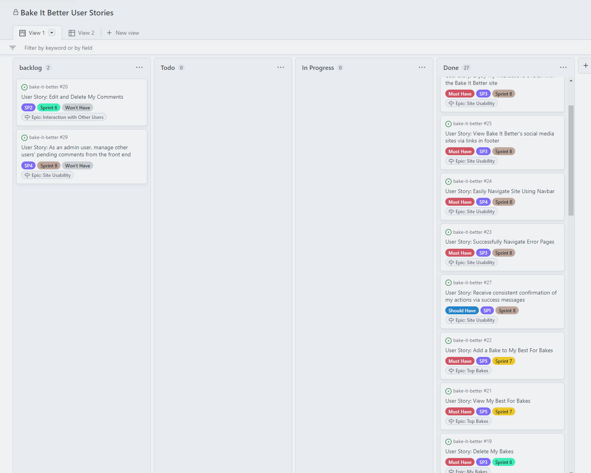

# Bake It Better Agile Development

Bake It Better was developed using an Agile approach in a series of sprints that are summarised below. GitHub Projects was used to create [this project board](https://github.com/users/frankiesanjana/projects/6/views/1) to aid in Agile development.

Initially, a number of Epics were defined, as follows:

- Site Administration: this Epic is for the admin user to manage the site from the admin panel.
- User Navigation: this covers ease of navigation for general site users, both in terms of being physically able to navigate between pages and also points such as being easily able to identify the site's purpose on a first visit.
- User Profile: this Epic is for user stories relating to authentication of users such as creating and logging into and out of accounts.
- My Bakes: covers the CRUD functionality on bakes that a general site user adds themselves from the front end.
- Interaction with Other Users: for users to comment on or "star" (functioning as both a "like" and a bookmark-type functionality) others' bakes.
- Top Bakes: allows users to save bakes for different occasions to a planner-style database, termed "Best For Bakes" since the intention is for a user to be able to save bakes as being "best for" a certain occasion category (e.g. a bake to make with kids, a recipe for something to take to a party, etc.).
- Site Usability: this related to the overall look, feel and ease of use of the website, including basic features such as correct display of the site header and footer, as well as custom error pages, consistent confirmation of actions via success messages and enabling admin capabilities for the admin user from the front end.

In addition, Project Setup was treated as an Epic for the management of development. In hindsight it would probably have been more appropriate to manage this separately, since it relates to development and not to the user experience.

Development was divided into sprints that were intended to be approximately equal in terms of time spent working on the project (there is wide variation in calendar days due to my outside schedule). Where it made sense to do so, a sprint would be aligned with an Epic.

Epics were divided into User Stories, which are shown in the [project board](https://github.com/users/frankiesanjana/projects/6/views/1). For each User Story, acceptance criteria have been defined and then further broken down into the tasks that need to be completed before the User Story can be confirmed as Done. Story points were also estimated for each User Story.
- The story points were difficult to estimate since it was not always obvious when a task would be simple and when it was more complex. Although I feel that I have a better idea of this at the end of the project than I did at the beginning, it seems that accurately predicting how much time might be spent debugging an issue is likely to remain challenging.

An image of the [project board](https://github.com/users/frankiesanjana/projects/6/views/1) at completion is shown below; for more detail please view the [board itself](https://github.com/users/frankiesanjana/projects/6/views/1) and the details contained in the User Stories within it.

## Sprint 1: Project Setup (17 Sep 22)

This was a very short sprint to set up the project and enable the following sprints to take place.
-	In hindsight, the time taken in getting the project to deploy successfully via Heroku would probably have raised the overall story point total for this piece to 5-6 rather than the 4 initially estimated.

## Sprint 2: Creation of project board; development of epics and user stories; design features; setup of the admin panel (17-28 Sep 22)

This sprint was light on coding and output since I spent much of it figuring out how to use the GitHub project board and create issues and milestones, as well as noting what my Epics and User Stories would be and considering how the overall structure of the site would look. 

The coding work that was undertaken focused around the Site Admin epic and formed a relatively small part of the overall sprint. Enabling full CRUD functionality for the site admin panel was deemed a ‘must-have’ for this sprint, while approving comments was a ‘should-have’ since this was both a discrete task that could be pushed to the following sprint if necessary and is also less critical for the overall functioning of the site.
-	I am still not confident that I have a good ‘feel’ for story points: although I think the scoring of the user stories within this epic relative to one another is about right, perhaps the overall numbers need to be higher so that a more granular level can be described in user stories still to come.

## Sprint 3 – Creation of initial views and templates (29 Sep – 4 Oct 22)

This was a more rewarding sprint than the previous one as the site started to take shape and I managed to write some original code that worked first time and successfully address some bugs that I discovered along the way (described in the Bugs section of the [Testing](https://github.com/frankiesanjana/bake-it-better/blob/main/docs/Testing.md) document).

I decided during this sprint to focus on a ‘minimum viable product’, pulling the main structure of the site together. I am still hoping to be able to go back and add the ‘Best For’ bakes at a later date, but for now the priority will be getting the essential functionality working.

I also realised that my development was being hampered by a lack of knowledge in two separate areas: Bootstrap and Django. I have chosen to focus first on the Django component, so that the site content and functionality are broadly in place first, and then work more on the appearance of the site in a later sprint.

This sprint focused mainly on the User Navigation epic. Some user stories within this epic are dependent on the final layout of the site (e.g. navigating between the different pages), but the majority were addressed here.
-	Since it made sense to add the commenting functionality from the Interaction with Other Users epic, this was also included as a ‘should-have’. 
-	The ability to see how many users have starred a bake is a nice-to-have but is not essential to the site’s functionality. For this reason it was deemed a ‘could-have’. In the event it was simple to add and I had plenty of time remaining, so I included it in the sprint.

## Sprint 4 – Adding account registration capabilities and the ability for users to comment on a bake (4-17 Oct 22)

In Sprint 4 I continued the focus from the previous sprint of getting the functionality I wanted in place, planning to return at a later stage to work on the appearance of the site.

The main focus of this sprint was around the User Profile epic, ensuring that account creation and user login / logout functionality worked as intended.

I also added flash messages to the site at this point to confirm login and logout to the user and used [Bootstrap Icons](https://icons.getbootstrap.com/) to customise these messages slightly from the standard message provided by Django.

The navbar was adjusted to display the username when the user is logged in, so that the user can see at a glance that they are currently logged in (and if multiple users share a device, which user they are logged in as). The ability for users to comment on bakes was also added, beginning the Interaction with Other Users epic.

I had initially also hoped to add the ‘star a bake’ functionality (comparable to a ‘Like’ except that a user will also be able to view a list of the bakes that they have starred, similar to a bookmarking functionality) during this sprint. However, by the end of the allocated time period I had not been able to start this and so it was deemed a ‘Won’t Have’ for the current sprint and reallocated to Sprint 5.

## Sprint 5 – Adding Starred Bakes functionality (7-14 Nov 22)

The first task was to add the ‘star a bake’ functionality. This had been reallocated from Sprint 4 and was therefore a ‘Must Have’ for the current sprint.

I also wanted to add functionality to enable users to see at a glance whether they had already starred a given bake in the list of all bakes. The bake stars were adjusted to appear colour-coded in the lists of bakes: gold if a signed-in user has starred them, solid grey if other users have starred them and an empty outline if a bake has no stars yet. (Please note that since this was later judged to be too much information on the bakes list, this now displays only on the detailed view of each bake, not the cards in the list.)

The ability for a user to view all the bakes that they have starred was also added during this sprint. This is intended to function similarly to a bookmarking capability. By clicking on the ‘My Starred Bakes’ link, a signed-in user can view all the bakes that they have starred in a list similar to the main list of bakes.

## Sprint 6 – Adding CRUD functionality on the front end (24-30 Jan 23)

This sprint had three major tasks: since users can already view bakes (and do not need to be signed into the site to do so), the ability for them to add, edit and delete bakes was required.

The sprint was challenging but rewarding, with a number of issues and bugs that needed to be solved. By the end of the sprint my understanding and knowledge were significantly better, and the CRUD functionality for the bakes themselves was fully functional.

Given that there was more debugging involved than I had anticipated, in retrospect the story points for this sprint could have been slightly higher across the board. As a result of this, the ability to edit and delete comments that users had previously made was deemed a ‘Won’t Have’ for the current sprint, since it was the only item that was less critical to the main site functionality. Hopefully this can be added at a later stage.

## Sprint 7 – Add Best For Bakes functionality (31 Jan – 6 Feb 23)

This sprint completes the last major piece of functionality that I have been hoping to add to the project. It was quite challenging since the logic to display the plan and correctly assign the bakes to each Best For occasion was tricky both to conceptualise and then to write correctly.

I underestimated the number of story points for viewing the bakes, since developing the logic to render this correctly was where a large majority of time was spent in this sprint. However, I inadvertently compensated for this in the sprint overall by overestimating the story points for adding the modal that allows a user to add a bake to their best for bakes. I had imagined that this would be very complex, but it turned out to be much easier than I anticipated thanks to the clear and simple [instructions](https://getbootstrap.com/docs/4.6/components/modal/) in the Bootstrap documentation.

## Sprint 8 – Site Usability (6 – 28 Feb 23)

This sprint focused on improving the look and feel of the site and making it easier for users to navigate. This involved adding custom error pages, adding styles to the website, adding some ability for admin to work with other users’ content from the front end, and some smaller pieces of tidying up such as ensuring that user actions were consistently confirmed by success messages.

This was one of the more challenging sprints for me since I find it hard to judge what users will find aesthetically appealing. For this reason several small pieces of testing on a single user were carried out during this sprint, where I asked for the user’s reaction to the appearance as I was customising the website. Some quotes that illustrate the feedback I obtained at this point are below:
-	“I really like what you’ve done with the logo.” (no prompt)
-	“It’s readable and looks great!” (when asked about the font choice for the bake and page titles) … “but I would change the sub-header font to something simpler [instead of the font used for the bake and page titles] since here it is a bit harder to read.”
-	“No, keep it – I would like to see the date a bake was posted so that I can see what’s been added recently or since I was last on the site.” (when asked if the date and time added unnecessary clutter to the bake list)
-	“Get rid of that grey colour [the original background colour for cards and buttons], use a lighter shade that is similar to the background colour of the main page” (no prompt)

The sprint also incorporated site usability from the point of view of the admin user.
- Ideally I would have added the capability for the admin user to implement all functionality from the front end, so that they would never need to log into the admin panel. 
- Since users are able to add their own bakes without needing admin approval, the ability for the admin user to edit or delete other users’ bakes from the front end was deemed to be the more important piece and was assigned as "Could Have"; this was successfully completed in the sprint.
- Approving comments from the front end was also considered, though this was less important, since it involves approving pending content rather than potentially removing unwanted existing content. Unfortunately due to time constraints this has been designated a "Won't Have" in the current sprint and will remain an aim for the future.