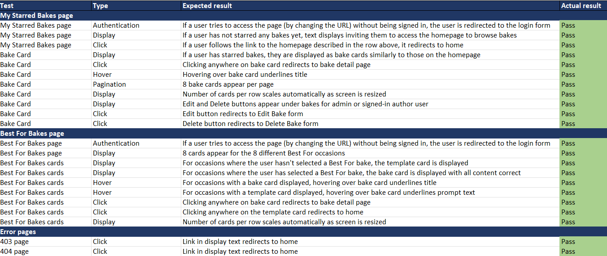
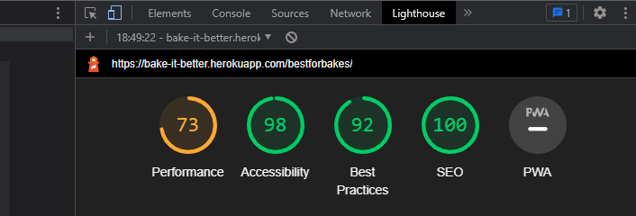

# Bake It Better Testing

Testing was carried out from a number of different perspectives:

- Continuous manual testing during development by running the server and checking that the functionality I was adding worked as intended
- User testing of the concept in order to develop personas
- User testing of the site within the development environment, in particular with regard to the look and feel of the site
- User testing of the deployed site (open feedback)
- User story testing
- Automated Django testing
- Manual testing of the deployed site
- Testing of the deployed site across a range of browsers, screen sizes and devices
- Colour contrast testing in order to ensure accessibility
- Lighthouse testing
- Validator testing
- Resolved Bugs
- Unresolved Bugs

These are described in more detail below.

## Manual Testing During Development

The program was tested continuously by running the local server during its development. Each time a new piece of functionality was created, I ran the server in order to test whether it functioned as intended. This allowed debugging to take place as problems arose, helping me to isolate the cause of bugs relatively quickly rather than attempting to debug once the code was more complex. A detailed description of the bugs encountered during development is given in the Bugs section below.

Once the program had been successfully deployed to Heroku, I followed the logic flow through all the user actions that can be taken on the website to check that it responded appropriately; full details of this are provided in the "Manual Testing of the Deployed Site" section below.

## User Testing: Concept

The concept of the site was tested by interviewing actual and potential users of baking recipes and websites, as well as discussion with my mentor. Users were asked about whether they baked themselves and if not whether they would like to. If so, a conversation took place around their baking habits: when and why they bake, where they source recipes from, whether they make the same bake multiple times and who they bake for. Based on these conversations, user personas were developed; these are described in more detail in the general Readme.

In particular, the "Best For" concept was based on user comments, for example:
- "Cookbooks often group recipes by type (e.g. for a baking book, bread, cakes, biscuits etc.). However, I would find it useful to have the option to sort recipes by occasion - for example if my grandkids are coming over, I'd like to have a collection of recipes that are easy and fun for them to make."
- "Sometimes I would love to see options that are great for taking to a party: bakes that are easy to make but look impressive and are easily divided into portions to share while still looking good."
- "What about a section of bakes that are a bit more complicated but could be really rewarding to make at the weekend or on a bank holiday when you have the whole day free?"

The ability to star bakes both as a bookmark-style function and to show appreciation of other users' recipes was also identified as a desired capability in the user interviews; for this reason it serves to fulfil both these functions in Bake It Better.

## User Testing During Development

One of the limiters of this project in terms of my own skillset is that I find it hard to intuitively understand the aesthetics of what is pleasing and easy to work with from an end user perspective. In a real-life situation I would be likely to work with a graphic designer and / or have client feedback or colleagues around me, but for this project this was not the case. 
For this reason I interviewed users where possible to obtain feedback on the look and feel of the site from an end user perspective. Some quotes from users are below:
- “I really like what you’ve done with the logo” (no prompt)
- “It’s readable and looks great!” (when asked about the font choice for the bake and page titles) … “but I would change the sub-header font to something simpler [instead of the font used for the bake and page titles] since here it is a bit harder to read”
- “No, keep it – I would like to see the date a bake was posted so that I can see what’s been added recently or since I was last on the site” (when asked if the date and time added unnecessary clutter to the bake list)
- “Get rid of that grey colour [the original background colour for cards and buttons], use a lighter shade that is similar to the background colour of the main page” (no prompt)

## User Testing of the Deployed Site

I sought user feedback on the deployed site once it was tested as working correctly and obtained a number of feedback items that have been implemented:

Add text to My Starred Bakes page if no bakes have been starred yet - initially this was displaying as a blank page if no bakes had been starred, which was confusing for the user. I added a message to be shown in the eventuality that no bakes had yet been starred, linking users to the homepage so they can browse and star bakes:

Add cancel button on signout form - I had originally set up the Sign Out form without a Cancel button, reasoning that this was purely a confirmation screen and users could use the navigation links in the navbar if they decided to remain signed in after all:

However, it was deemed a better user experience to have the option to click the Cancel button to cancel signout as well, so this was added:

Make the whole Bake card clickable rather than just the title.
- I was initially concerned that this could end up being complex to implement, but it was extremely easy to do by adding `stretched-link` to the link tags since [Bootstrap have built this functionality in](https://getbootstrap.com/docs/4.6/utilities/stretched-link/).

Remove the stars display on the bake-detail page for users who are not signed in, since they need to be signed in to star the bake themselves and this could be too confusing.
- I had initially thought that this would be fairly self-explanatory (compare Instagram or Facebook for example where it is possible to see the number of likes on a post without being logged in, but users must be logged in to like the post themselves).
- However, following discussion with users, to ensure a smooth experience for all users it was ultimately decided to remove this view for users who are not signed in.

## User Story Testing

Each user story had clearly defined acceptance criteria, which made it easy to verify when a user story was successfully completed. As an example, the user story "As a site user, I can save a bake to a slot in My Best For Bakes, so that I can make a note of a bake that will be useful in a particular situation." is shown below. Once I had finished coding, I ran the local server and manually verified that each of the acceptance criteria had been met. Once the changes had been pushed to the deployed site, this manual testing process of each of the acceptance criteria was repeated.

Thus for this example, I checked that:
- For a logged-in user's Best For plan, the plan loaded correctly and contained links by each slot to add a bake (for empty slots) or change the bake (for currently filled slots).
- Both of these links worked correctly and redirected to the homepage.
- When a bake appeared in a Best For plan slot, clicking on the bake card correctly redirected to the `bake-detail` page for that bake.
- When a bake is viewed in its `bake-detail` page and the user is signed in, a button appears before the bake description with an option "Add to Plan".
- Clicking the "Add to Plan" button causes a modal to appear so that the user can add the bake to their Best For plan.
- Clicking "Cancel" or clicking outside the modal removes the modal.
- Selecting an occasion and clicking "Save" saves the bake to the correct occasion, removing the modal.
- Following this, navigating to the Best For Bakes page displays the saved bake correctly in the selected occasion. It will replace whichever of the template card or an existing bake was previously present in that slot.

This process has been repeated for each of the user stories that are marked as Done in the project board.

## Automated Django Testing

The first step in the automated testing process was to check everything worked via a “test test” by creating a TestCase class in the sheet `bakes/tests.py`. This initially produced an error with the message “permission denied to create database”. This was because I had not realised that when running tests it is necessary to use the local sqlite db and not the postgres one. Conditional formatting has now been applied to the databases so that if Debug is set to True the local database is selected and tests can be performed, but otherwise the postgres database is used so that the site works correctly.

Once I had adjusted this so that the local database was used and the postgres one temporarily disabled, the test ran as intended, giving a fail since I had used `assertEqual(1, 0)`.
I then ran a second test designed to pass, to ensure that a passing test would be evaluated correctly as passing, and obtained the result I was looking for. Since these tests were then deleted, they are also shown here:

After this, three testing files were created, to test the forms, the views and the models.

The form testing in `test_forms.py` was relatively straightforward, using the examples laid out in Code Institute's Hello Django testing section. Tests include:

- Testing that the title is required for Bake form submission - pass
- Testing that the equipment needed list is required for Bake form submission - pass
- Testing that the ingredients list is required for Bake form submission - pass
- Testing that the method is required for Bake form submission - pass
- Testing that the description is not required for Bake form submission (since a user might have a favourite recipe but not have the time or creativity needed to write a description) - pass
- Testing that fields are explicit in the form metaclass for the Bake form - pass
- Testing that the message body is required for Comment form submission - pass
- Testing that fields are explicit in the form metaclass for the Comment form - pass
- Testing that the "Best For" field is required for BestFor form submission - pass
- Testing that fields are explicit in the form metaclass for the BestFor form - pass

The view testing in `test_views.py` was, as expected, a little more complicated, and unfortunately in view of time constraints I was not able to test every part of the `views.py` file completely. However, the full CRUD functionality and the ability for a signed-in user to star a bake was tested within the automated tests, and overall I am reasonably satisfied with this approach in combination with thorough manual testing.

First, `setUp` and `tearDown` classes were created, to create and destroy the test objects used to perform the view testing in multiple tests, so that these did not need to be created multiple times. Tests were then written, including:

- Testing that the main page of the site with the bake list loads correctly (response code 200) - pass
- Testing that the bake-detail.html page showing the detailed description of each bake loads correctly (response code 200) - pass
- Testing that the signup page for new users loads correctly (response code 200) - pass
- Testing that the login page loads correctly (response code 200) - pass
- Testing that the Add Bake page loads correctly for a signed-in user (response code 200) - pass
- Testing that the Edit Bake page loads correctly for a signed-in author user (response code 200) - pass
- Testing that the Delete Bake page loads correctly for a signed-in author user (response code 200) - pass
- Testing that the Best For Bakes page loads correctly for a signed-in user (response code 200) - pass
- Testing that the My Starred Bakes page loads correctly for a signed-in user (response code 200) - pass
- Testing that the logout page loads correctly for a signed-in user (response code 200) - pass
- Testing that a signed-in user can successfully add a bake, by creating a new bake and then asserting that this new bake exists - pass
- Testing that a signed-in author user can successfully edit a bake, by editing an existing bake and then asserting that the edited bake exists - pass
- Testing that a signed-in author user can successfully delete a bake, by deleting an existing bake and then asserting that the deleted bake does not exist - pass
- Testing that a signed-in user can successfully star a bake, by creating and starring a new bake and then asserting that the bake is starred - pass

Similarly, for the model testing in `test_models.py`, the automated testing focused around the Bake model, since this is the largest and most complex model, and this is combined with extensive manual testing in order to ensure the site functions as intended.

Again, `setUp` and `tearDown` classes were created, to create and destroy the test objects used to perform the model testing in multiple tests, so that these did not need to be created multiple times. Tests were then written, including:

- Testing that the bake slug is successfully created from the title in the Bake model - pass
- Testing that the string is successfully created in the Bake model - pass
- Testing that a new bake created using the Bake model defaults to not being starred when it is created - pass

To ensure that I had, in fact, tested a reasonable proportion of the site via automated testing, I created a coverage report. The details of this can be seen below:

## Manual Testing of the Deployed Site

Manual testing results are displayed in the images below:

 

 

 

 

## Testing of the deployed site across a range of browsers, screen sizes and devices

The site has been tested on the following devices and browsers and found to be working as intended:
- Chrome, Safari, Firefox on iPhone 14 Pro
- Chrome on iPhone XS
- Chrome, MS Edge on ASUS Vivobook Pro 14 OLED
- Chrome, Firefox on Pixel 5 phone
- Chrome on Samsung Galaxy A21 phone
- Chrome, Firefox on Lenovo M8 tablet

I also used Chrome Dev Tools to view the site as it would appear on the following devices, all of which functioned as intended:
- iPhone SE
- iPhone XR
- iPhone 12 Pro
- Pixel 5
- Samsung Galaxy S8+
- Samsung Galaxy S20 Ultra
- iPad Air
- iPad Mini
- Surface Pro 7
- Surface Duo
- Galaxy Fold
- Samsung Galaxy A51/71
- Nest Hub
- Nest Hub Max

## Colour contrast testing in order to ensure accessibility

The colour contrast of the website was tested by using the [Coolors colour checker](https://coolors.co/contrast-checker). The results are as follows:

- Text against the main background colour: "good" contrast for smaller text and "great" contrast for larger text or smaller bold text

- Text against the main background colour: "good" contrast for smaller text and "great" contrast for larger text or smaller bold text

## Lighthouse Testing

Lighthouse testing was undertaken in Chrome's Developer Tools. The Lighthouse reports brought to light several issues, most notably relating to the Performance metric. The initial testing on the homepage was as follows:

The images were a potential source of the performance issue. However, testing on the Add Bake page showed an even poorer performance score:

And the Best For Bakes page, which always contains eight images, returned a better score:

Moreover, the image size is difficult to control because the images are uploaded by the site users. Ideally a future feature of the website could be to resize them automatically when they are uploaded, although it is not certain how much difference this would make. It is also possible that part of the issue is caused by using free hosting for the site on Heroku, since this is likely to be slower than paid hosting.

Other issues that were brought to light by the testing include some accessibility issues, where not all buttons had `aria-label` attributes (now rectified), and the issue that headings were not used in descending order (beginning at `h1`, then `h2` and so on). This has also now been rectified using a combination of adjusting the headings to appear in the correct order and where appropriate using `p` elements with classes and applying styling to these instead.

Following correction of these issues, we can see that, for example, the homepage Accessibility score has now improved to 100%:

## Validator Testing

### PEP8 Testing

The Python code was run through [CI's Python Linter](https://pep8ci.herokuapp.com/). Several files returned no errors, but some examples of those that did are shown below:

Initially I obtained a number of "line too long" errors, trailing whitespace at ends of lines and some line spacing errors, as well as one place in the `forms.py` file where the indentation had not worked correctly. These issues were fairly simple to rectify, and all files then returned the "All clear, no errors found" message:

### HTML Testing

The HTML source code was checked using the [W3C HTML Validator](https://validator.w3.org/). Note that to do this for pages containing Django templating language, one way to do this without the templating language causing errors is:
- Navigate to the deployed webpage to be tested
- Right click on the webpage and select "View Page Source". A new tab should open containing the HTML source code.
- Select the new tab. Highlight all the code (in Windows, use Crtl + A) and copy it (Ctrl + C).
- Open the W3C validator page and select "Validate by Direct Input".
- Paste the code into the textbox (Ctrl + V) and click on the "Check" button below.

The validator initially produced two errors:
- In the footer in `base.html`, I had previously been advised to use `_fb`, `_twitter` and `_insta` in place of `_blank` for the `target` attribute. The validator returned an error for these, so I have replaced them with `_blank`.
- The validator also found an instance of an opening and closing tag not matching, where I had opened a section of text with an `<h5>` tag and closed with a `
` tag in `best-for-bakes.html`. This has now been adjusted.

The validator then returned all pages with no errors:

### CSS Testing

The CSS code was copied from the stylesheet and pasted into the [W3C CSS Validator](https://jigsaw.w3.org/css-validator/validator). It returned with no errors found:

### JavaScript Testing

Although the only JavaScript used in the project, in `base.html`, is taken from the CI Walkthrough Project, I ran it through the [JSHint validator](https://jshint.com/) for completeness. Unsurprisingly, the testing returned no errors. It does note an undefined bootstrap variable, but this is due to it not being able to access the Bootstrap CDN import that is contained within the `script` tag and does not cause problems:

## Bugs
### Resolved Bugs

- The first bug I encountered provided an excellent example of why we should deploy early! In the first sprint of the project, my goal was to set up the Django project and deploy it to Heroku. At the deployment stage, I initially received an error message. I first wondered if I’d entered the wrong version of the filename in the Procfile and tried adjusting this; however, this did not solve the problem. Re-reading the code in the settings.py file revealed a simple typo, with a `/` instead of a `.` in the following line of code: `STATIC_ROOT = os/path.join(BASE_DIR, 'staticfiles')` rather than `STATIC_ROOT = os.path.join(BASE_DIR, 'staticfiles')`. Fixing this and then reverting the filename in the Procfile to what I had originally written fixed the problem and I was able to deploy the project successfully. Although this was a relatively trivial bug to resolve, I include it here for two reasons.
    - Firstly, as mentioned above, it reinforces the message about early deployment, since if I had waited to deploy until my code was much more complete it could have taken a lot longer to find the error.
    - Secondly, since I needed to commit and push changes several times to test the fix, it has impacted my early commit history for the project.

- When I added the URL for the `bake-detail.html` page, I could not get the server to run. After checking the code several times and rewriting it, I searched online and eventually realised thanks to [Stack Overflow](https://stackoverflow.com/questions/65670490/invalid-syntax-with-path-in-django-3-1-5) that I had omitted to add a comma at the end of the previous line when creating the new url path. Once I had added this the server ran as intended.

- Bake difficulty was initially displaying as the actual value (1, 2 or 3) instead of the human-readable name (easy, moderate or challenging). To fix this, I first tried rewriting the `difficulty` field as a `CharField` instead of an `IntegerField`. The server still ran but this did not fix the problem. From the [Django documentation on choices](https://docs.djangoproject.com/en/4.1/ref/models/fields/#choices) I then went to the [model instance reference documentation](https://docs.djangoproject.com/en/4.1/ref/models/instances/#django.db.models.Model.get_FOO_display). Changing the code as instructed in the documentation from `{{ bake.difficulty | safe }}` to `{{ bake.get_difficulty_display | safe }}` has fixed the bug.

- The alert dismissal button was originally not working as intended – this turned out to be a Bootstrap version compatibility issue, fixed by searching online and on Stack Overflow. Reading [this Stack Overflow post](https://stackoverflow.com/questions/70919863/why-is-the-dismiss-button-on-this-bootstrap-alert-not-working-in-my-flask-app) made me think that it could be a version compatibility issue and when I checked the code I had written against the version of Bootstrap I am using for the project, I was able to fix the bug by changing `class="btn-close" data-bs-dismiss="alert"` to `class="close" data-dismiss="alert"`.

- The My Starred Bakes page was not working as intended. Instead of the page loading showing a logged-in user’s starred bakes, a 405 error was being produced. I tried adjusting the path in the urlpatterns in `bakes/urls.py` in case I had made a mistake here, and also tried removing all the content of the `my-starred-bakes.html` page since a tutor suggestion was that this could be causing the page not to load. Neither of these fixed the issue, but going back to the view code to check everything was correctly connected, I realised that I had written the view as `class MyStarredBakes(View):` instead of `class MyStarredBakes(generic.ListView):`. Once this change had been made, the page loaded correctly.

- Adding the page for a user to add their own bake, I was unable to get the page to load and was receiving a 404 error message. I tried adding the content code to the template page in case this could be causing the issue (my intention had been to wire everything up first and then add the content), as well as checking my url pattern, view and form had been created correctly.
    - I suspected that there was a small mistake somewhere resulting from something that I wasn’t understanding, but was unable to identify what the problem was.
    - Fortunately I was able to make use of Tutor Support, who explained to me that the previous path in the urlpatterns was causing the issue. This was the BakeDetail view, which was causing an issue because Django was using the first url path that matched the given structure and hence trying to use ‘addbake’ as a slug to find a bake.
    - The problem was then simple to fix by adjusting the code from `path('<slug:slug>/', views.BakeDetail.as_view(), name='bake-detail'),` to ` path('bake-detail/<slug:slug>/', views.BakeDetail.as_view(), name='bake-detail'),`.

- Several issues appeared when I set up the CRUD functionality for users to add, edit and delete their own bakes. A number of these were readily solved with the help of the Django documentation:
    - Add Bake wasn’t working because I had not defined the `get_absolute_url` for bake submission in the model.
    - Edit Bake and Delete Bake were failing to allow even the signed-in user who had created them to modify them. This needed a line of code adding to each class view in `views.py` to define the `Bake` before attempting to return its author: `Bake = self.get_object()`.
    - Finally, Delete Bake was not working because I had incorrectly defined the `success_url`.

- For another of the CRUD issues, I was able to find the answer online. The issue was that success messages were not working when a bake was deleted. This is because the SuccessMessageMixin in Django is form-based and the DeleteView I was trying to combine it with is not a form-based view. However, I was able to find a solution to this on [Stack Overflow](https://stackoverflow.com/questions/24822509/success-message-in-deleteview-not-shown) and adapted this code to use for my own site.

- Some of the issues with CRUD functionality required further help from Tutor Support:
    - When the admin user logged in via the site to edit a post created in the admin panel, the html tags around the content were pulled into the form to be edited, as well as the actual content itself. However, if admin or other users create a post via the CRUD functionality on the site itself and then try to edit it, it worked correctly (no html tags appear in the form, just the previously created content). This was because Summernote was used and this saves the entry as a string of HTML text. When this is rendered in the HTML, the tags are therefore included. This was solved by using a Summernote widget for Summernote fields within the `BakeForm` class in `forms.py`.
    - There was also a problem with images not being uploaded successfully when a user tried to add an image via the Add Bake or the Edit Bake forms on the front end. This was solved by including the `enctype` attribute in the forms as described in [this article](https://www.w3schools.com/tags/att_form_enctype.asp), as `enctype="multipart/form-data"`.

- My initial attempt at creating the Best For Bakes plan had all the bakes that a user had saved to their plan displaying in every occasion slot:

- This was because I had not written the logic in `views.py` in such a way that I could iterate over a dictionary to display the bakes, and was then filtering incorrectly within the template. The logic I had written effectively said, “if a user has saved a bake as this plan option, display all their plan bakes in this slot”.
    - It was clear why this was wrong, but in practice the issue was hard to fix and required a number of online tutor support sessions, since several attempts at rewriting the code only led to further error messages.
    - I got the code working correctly but it was rather inelegant at this point since it involved manually writing out each of the eight Best For options in the code; I had intended to iterate through the options to populate the dictionary automatically but was struggling to do this.
    - After leaving this section for quite some time and returning to it with fresh eyes and mentor guidance, I have now been able to refactor the code such that it uses a `for` loop to populate the dictionary as desired.

- A bug was present in the footer whereby the footer did not stick to the bottom of the page on larger screens. I initially tried to fix this by using `position: fixed` on the footer at larger screen sizes (992px and above). However, this led to the footer initially jumping to overlap with the previous element when the viewport reached 992px and then gradually disappearing off the bottom of the screen as the viewport width increased. I experimented with a number of options, including adding margin and padding to the top of the footer or the bottom of the previous container, adjusting the z-index of the footer and applying the CSS `clear: both` to the footer. However, none of these were successful. With help from tutor support, I was able to use the Flexbox method to style the footer as follows:
    - Remove all positioning CSS from the footer, as well as the footer height
    - Wrap the block content above the footer in a `main` tag
    - Add the following CSS to the body and main elements:
 

- At this point the footer was appearing on larger viewports but still had too much blank space underneath it.
    - This was caused by the CSS I had applied to the `footer i` where I had used a percentage to set the margins.
    - By changing this to a set margin of 50px, the issue was resolved.

### Unresolved Bugs

- As far as I am aware, there are no current unresolved bugs.