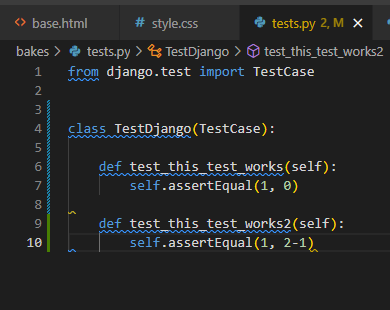

# Bake It Better Testing

Testing was carried out from a number of different perspectives:

- Continuous manual testing during development by running the server and checking that the functionality I was adding worked as intended
- User testing of the concept in order to develop personas
- User testing of the site within the development environment, in particular with regard to the look and feel of the site
- User testing of the deployed site (open feedback)
- User story testing of the deployed site
- Automated Django testing
- Manual testing of the deployed site
- Testing of the deployed site across a range of screen sizes and devices
- Colour contrast testing in order to ensure accessibility
- Validator testing
- Resolved Bugs
- Unresolved Bugs

## Manual Testing During Development

The program was tested continuously by running the local server during its development. Each time a new piece of functionality was created, I ran the server in order to test whether it functioned as intended. This allowed debugging to take place as problems arose, helping me to isolate the cause of bugs relatively quickly rather than attempting to debug once the code was more complex. A detailed description of the bugs encountered during development is given in the Bugs section below.

Once the program had been successfully deployed to Heroku, I followed the logic flow through all the user actions that can be taken on the website to check that it responded appropriately; full details of this are provided in the "Manual Testing of the Deployed Site" section below.

## User Testing: Concept

The concept of the site was tested by interviewing actual and potential users of baking recipes and websites, as well as discussion with my mentor. Based on these conversations, user personas were developed; these are described in more detail in the general Readme.

In particular, the "Best For" concept was based on user comments, for example:
- "Cookbooks often group recipes by type (e.g. for a baking book, bread, cakes, biscuits etc.). However, I would find it useful to have the option to sort recipes by occasion - for example if my grandkids are coming over, I'd like to have a collection of recipes that are easy and fun for them to make."
- "Sometimes I would love to see options that are great for taking to a party: bakes that are easy to make but look impressive and are easily divided into portions to share while still looking good"
- "What about a section of bakes that are a bit more complicated but could be really rewarding to make at the weekend or on a bank holiday when you have the whole day free?"

The ability to star bakes both as a bookmark-style function and to show appreciation of other users' recipes was also identified as a desired capability in the user interviews; for this reason it serves to fulfil both these functions in Bake It Better.

## User Testing During Development

One of the limiters of this project in terms of my own skillset is that I find it hard to intuitively understand the aesthetics of what is pleasing and easy to work with from an end user perspective. In a real-life situation I would be likely to work with a graphic designer and / or have client feedback or colleagues around me, but for this project this was not the case. 
For this reason I interviewed users where possible to obtain feedback on the look and feel of the site from an end user perspective. Some quotes from users are below:
- “I really like what you’ve done with the logo” (no prompt)
- “It’s readable and looks great!” (when asked about the font choice for the bake and page titles) … “but I would change the sub-header font to something simpler [instead of the font used for the bake and page titles] since here it is a bit harder to read”
- “No, keep it – I would like to see the date a bake was posted so that I can see what’s been added recently or since I was last on the site” (when asked if the date and time added unnecessary clutter to the bake list)
- “Get rid of that grey colour [the original background colour for cards and buttons], use a lighter shade that is similar to the background colour of the main page” (no prompt)

## User Testing of the Deployed Site

## User Story Testing of the Deployed Site

## Automated Testing

The first step in the automated testing process was to check everything worked via a “test test” by creating a TestCase class in the sheet `bakes/tests.py`. This initially produced an error with the message “permission denied to create database”. This was because I had not realised that when running tests it is necessary to use the local sqlite db and not the postgres one, which is used in the deployed project as shown below:

Once I had adjusted this so that the local database was used and the postgres one temporarily commented out, the test ran as intended, giving a fail since I had used `assertEqual(1, 0)`.
I then ran a second test designed to pass, to ensure that a passing test would be evaluated correctly as passing, and obtained the result I was looking for. Since these tests were then deleted, they are also shown here:

After this, three testing files were created, to test the forms, the views and the models.

The form testing in `test_forms.py` was relatively straightforward, using the examples laid out in Code Institute's Hello Django testing section. Tests include:

- Testing that the title is required for Bake form submission - pass
- Testing that the equipment needed list is required for Bake form submission - pass
- Testing that the ingredients list is required for Bake form submission - pass
- Testing that the method is required for Bake form submission - pass
- Testing that the description is not required for Bake form submission (since a user might have a favourite recipe but not have the time or creativity needed to write a description) - pass
- Testing that fields are explicit in the form metaclass for the Bake form - pass
- Testing that the message body is required for Comment form submission - pass
- Testing that fields are explicit in the form metaclass for the Comment form - pass
- Testing that the "Best For" field is required for BestFor form submission - pass
- Testing that fields are explicit in the form metaclass for the BestFor form - pass

The view testing in `test_views.py` was, as expected, a little more complicated, and unfortunately in view of time constraints I was not able to test every part of the `views.py` file completely. However, the full CRUD functionality and the ability for a signed-in user to star a bake was tested within the automated tests, and overall I am reasonably satisfied with this approach in combination with thorough manual testing.

First, `setUp` and `tearDown` classes were created, to create and destroy the test objects used to perform the view testing in multiple tests, so that these did not need to be created multiple times. Tests were then written, including:

- Testing that the main page of the site with the bake list loads correctly (response code 200) - pass
- Testing that the bake-detail.html page showing the detailed description of each bake loads correctly (response code 200) - pass
- Testing that the signup page for new users loads correctly (response code 200) - pass
- Testing that the login page loads correctly (response code 200) - pass
- Testing that the Add Bake page loads correctly for a signed-in user (response code 200) - pass
- Testing that the Edit Bake page loads correctly for a signed-in author user (response code 200) - pass
- Testing that the Delete Bake page loads correctly for a signed-in author user (response code 200) - pass
- Testing that the Best For Bakes page loads correctly for a signed-in user (response code 200) - pass
- Testing that the My Starred Bakes page loads correctly for a signed-in user (response code 200) - pass
- Testing that the logout page loads correctly for a signed-in user (response code 200) - pass
- Testing that a signed-in user can successfully add a bake, by creating a new bake and then asserting that this new bake exists - pass
- Testing that a signed-in author user can successfully edit a bake, by editing an existing bake and then asserting that the edited bake exists - pass
- Testing that a signed-in author user can successfully delete a bake, by deleting an existing bake and then asserting that the deleted bake does not exist - pass
- Testing that a signed-in user can successfully star a bake, by creating and starring a new bake and then asserting that the bake is starred - pass

Similarly, for the model testing in `test_models.py`, the automated testing focused around the Bake model, since this is the largest and most complex model, and this is combined with extensive manual testing in order to ensure the site functions as intended.

Again, `setUp` and `tearDown` classes were created, to create and destroy the test objects used to perform the model testing in multiple tests, so that these did not need to be created multiple times. Tests were then written, including:

- Testing that the bake slug is successfully created from the title in the Bake model - pass
- Testing that the string is successfully created in the Bake model - pass
- Testing that a new bake created using the Bake model defaults to not being starred when it is created - pass

To ensure that I had, in fact, tested a reasonable proportion of the site via automated testing, I created a coverage report. The details of this can be seen below:

## Colour contrast testing in order to ensure accessibility

The colour contrast of the website was tested by using the [Coolors colour checker](https://coolors.co/contrast-checker). The results are as follows:

- Text against the main background colour: "good" contrast for smaller text and "great" contrast for larger text or smaller bold text

- Text against the main background colour: "good" contrast for smaller text and "great" contrast for larger text or smaller bold text

## Lighthouse testing

## Validator Testing - SECTION TO UPDATE
<!-- ### PEP8 Testing

The Python code was run through [PEP8 online](http://pep8online.com/):

Initially I obtained a large number of "line too long" errors, as well as one place where a function did not have two blank lines before it but only one, and one "trailing whitespace" error that was part of the ASCII art:

 

I spent some time adjusting the code so that the lines were shorter than 80 characters, inserted an extra blank line before the function, and was able to adjust the ASCII art without affecting the way it displayed. The code then passed through the validator successfully:

 -->
